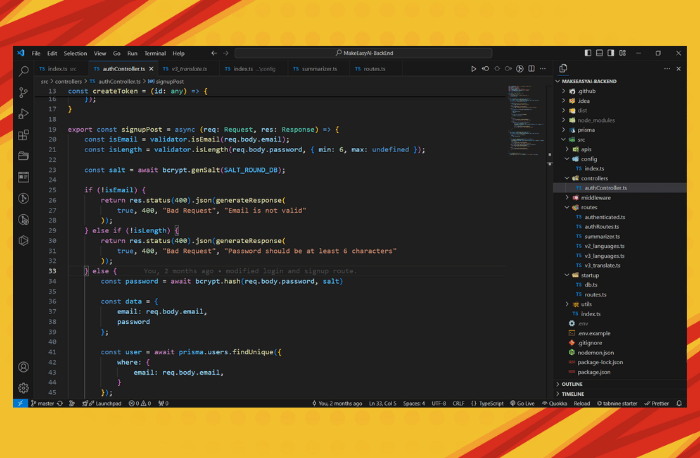

<h1> Make Easy AI Back End</h1>
    
<h2> A Modern Browser Extension for Translation and Summarizing </h2>

 

* Use JWT (Json Web Token on Auth).
* Uses Prisma ORM and PostgreSQL for Database.
* This API under the hood talk to Google Cloud Translate API for Translations.
* Under the hood it talk to Gemini AI for Summarizing.
* Integrated DevOps functionality with Google Could.

#### Technology: Express, TypeScript, Prisma ORM, PostgreSQL, JWT, Google Cloud Translate API, Gemini AI

 

## [See The Browser Extension of this Backend](https://github.com/sakibcy/MakeEasyAI-Extension)

